# Integrated Development Environments Laboratory Work #1
## Setting server environment. Version Control Systems

For this laboratory as a remote server I will use DigitalOcean.com service. You can find more information about this hosting service on their site [DigitalOcean](https://www.digitalocean.com/). If you want to use first 10$ for free you can register using this [link](https://m.do.co/c/9fd3b727487a). You can see a tutorial about how to create host on their site.

## Connect via ssh
In your profile you can create an SSH key that you will use while connecting to host.  
After droplet was created you will see hosts **IP address**:

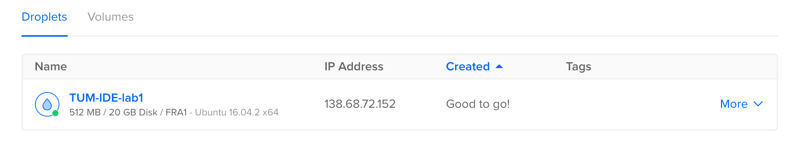

- Lets first of all check if we can see the machine. Ping it using ``` ping -c 4 138.68.72.152``` You should get something like this:

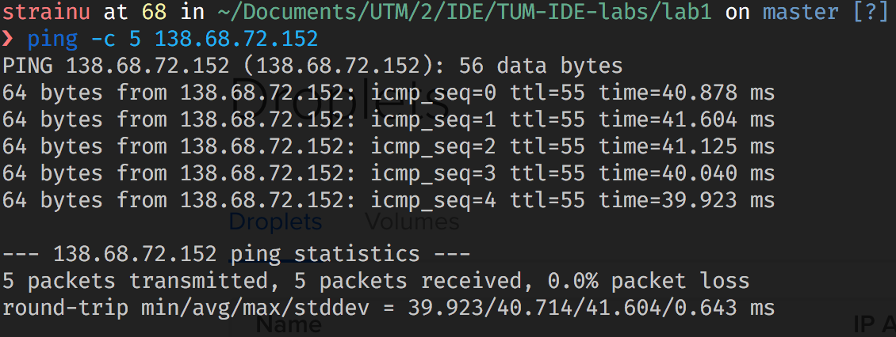

- Now we can easily connect with ssh to our remote server. In linux distributors we type in ```ssh  root@138.68.72.152```. You have to enter passphrase for your ssh key.

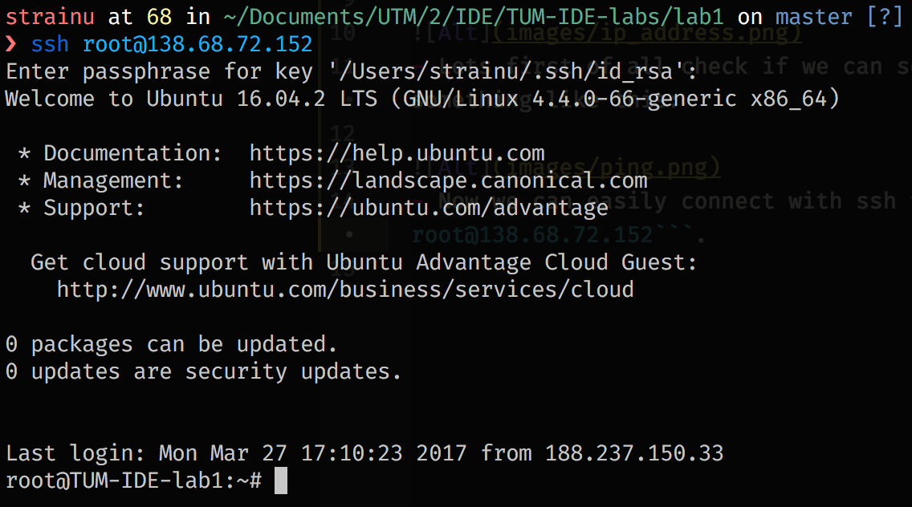

- Next we will install fish shell, a smart and user-friendly command line shell for macOS, Linux, and the rest of the family. More information [here](https://fishshell.com/).  
For installing fish we have to run following commands:
  * `sudo apt-add-repository ppa:fish-shell/release-2`
  * `sudo apt-get update`
  * `sudo apt-get install fish`
  * `fish` (to switch to fish shell)
  * `curl -L https://get.oh-my.fish | fish` (to install oh-my-fish. Check it [here](https://github.com/oh-my-fish/oh-my-fish))
  * `omf install simple-ass-prompt` (to install a simple theme)  

Shell should looks like:

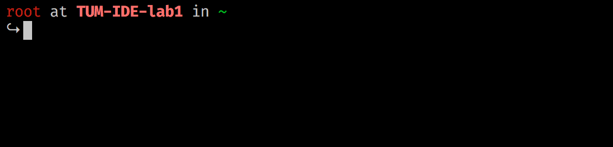

- Now we can perform any command from our terminal!

## Set up git

- First of all we have to install git `sudo apt-get install git`
- Configure global user	name `git config --global user.name "str.dr4605"`
- Configure global user	email `git config --global user.email "str.dr4605@gmail.com"`
- Initialize git repo `git init`
- Generate ssh key with `ssh-keygen`
- Set the public key in github
- Now we will add remote to our host `git remote add origin https://github.com/strdr4605/TUM-IDE-labs.git`
- Pull from remote repo to local `git pull origin master`
- Now can work further on this project

## Run some simple programs
- By default ubuntu has python install so we can run any python script. However in order to run any others we have install the necessary compilers. So type in the following commands to install gcc, g++, ruby and nodejs:  

    ```
    sudo apt-get install gcc   
    sudo apt-get install g++
    sudo apt-get install ruby-full
    sudo apt-get install -y nodejs
    ```
- After installation we can run **HelloWorldPrograms** that are located in `HelloWorldPrograms/` after we connected our local git with remote git from github.com

    ```
    gcc HelloWorldPrograms/main.c -o main
    ./main

    g++ HelloWorldPrograms/main.cpp -o maincpp
    ./maincpp

    ruby HelloWorldPrograms/index.rb

    nodejs HelloWorldPrograms/index.js
    ```
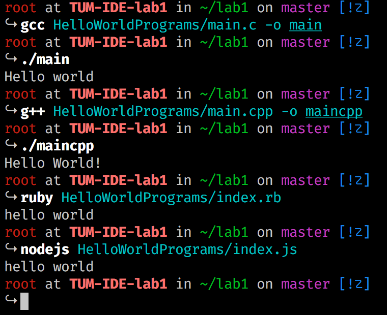

## Create new branches

- Add two new branches with `git branch nameOfBranch`
- Move to new branch with `git checkout nameOfBranch`
- Now we can commit to a new branch
- If we want to move back or to another branch use again `git checkout anotherBranchName`

This is how it looks in command line:

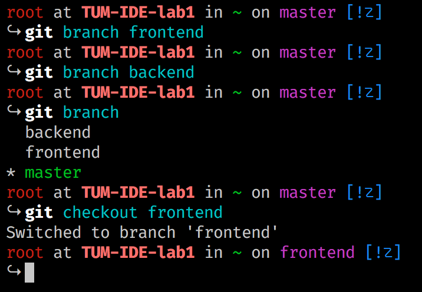

## Committing on each branch

- After switching to another branch using `git checkout frontend`
- Create a file and write in it using `echo "#Frontend changes" >> development.md`
- Adds all files to your local repository and stages it for commit. `git add .` (To unstage a file, use `git reset HEAD YOUR-FILE`.)
- Commit changes using `git commit -m "Some changes in development"`

Should looks like:

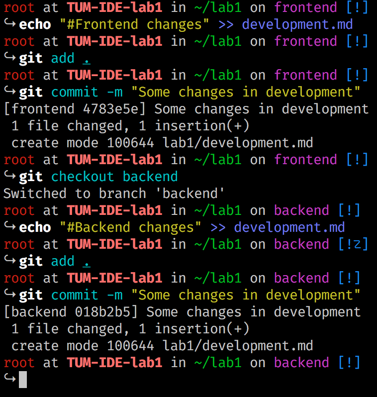

## Reset a branch to previous commit
- First we should all our commits using command: `git log`

    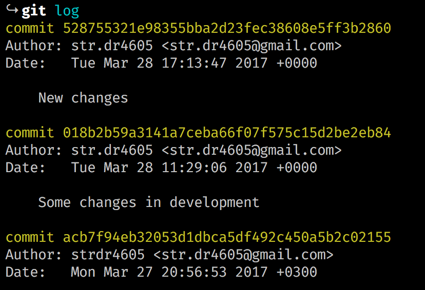

- Temporarily switch to a different commit: `git checkout <commitID>`

    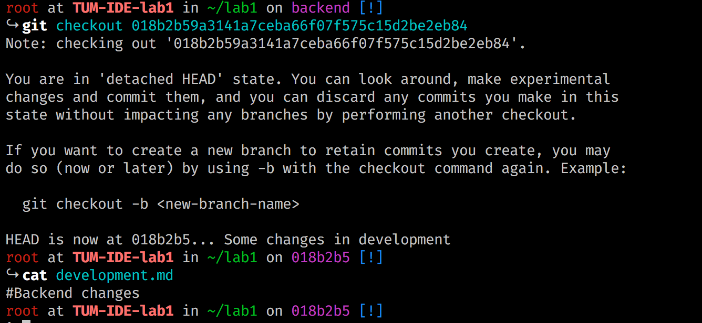

- Hard delete unpublished commits: `git reset --hard <commitID>` (will return do selected commit)

    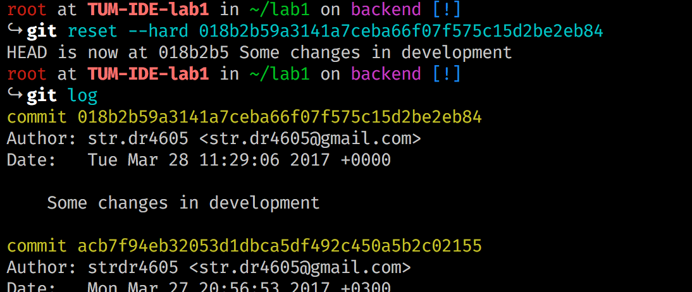

## Merge branches and resolve a conflicts
We will merge **frontend** branch in **backend**, so we should be on **backend** branch using `git checkout backend`  
Next merge using `git merge frontend`

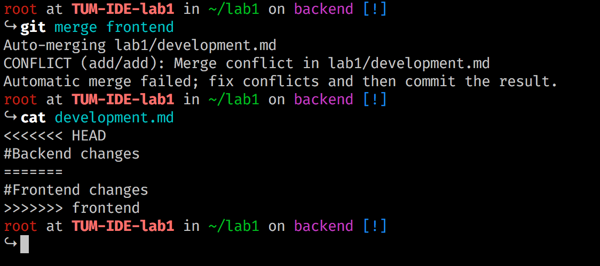

We successful merged 2 branches but we have a conflict. Let solve it and commit changes. I will use vim to edit development.md file. More about vim [here](http://www.vim.org/)

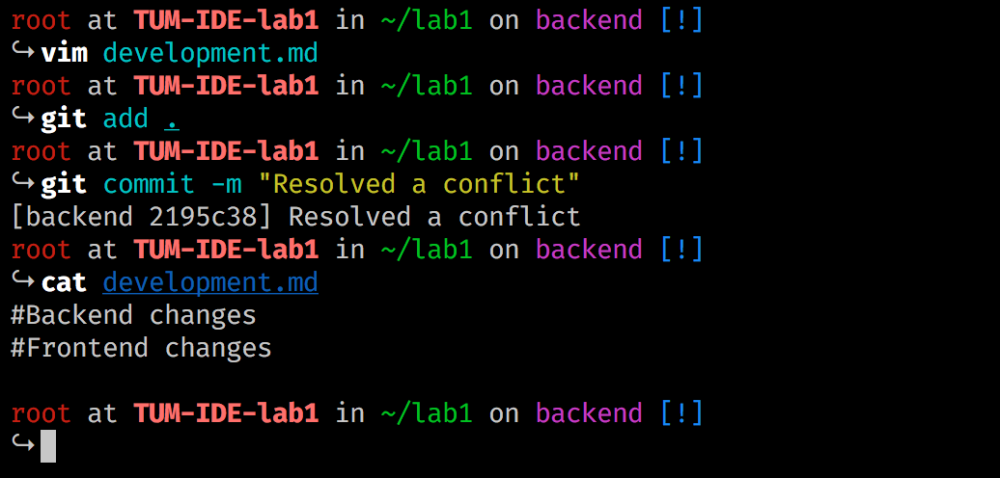


## Shell script
- To run a file from our HelloWorldPrograms folder we will write a shell script

    ```
    #!/bin/sh

    echo Enter file name
    read FILE
    case $FILE in
    	*.c) gcc HelloWorldPrograms/$FILE -o ${FILE%.*} && ./${FILE%.*}
    			 ;;
    	*.py) python HelloWorldPrograms/$FILE
    			 ;;
      *.js) nodejs HelloWorldPrograms/$FILE
      		 ;;
      *.rb) ruby HelloWorldPrograms/index.rb
           ;;

    esac
    ```

- Give execute permission to script: `chmod +x /path/to/yourscript.sh`
- Run script: `./yourscript.sh`

    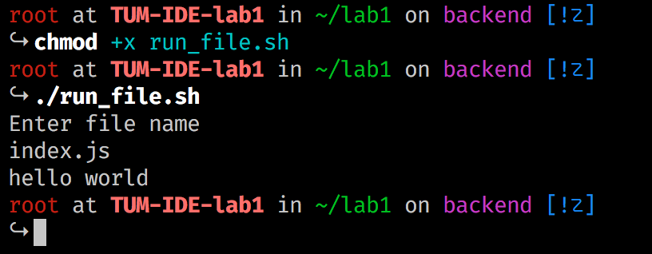

## GIT hooks
Git hooks are scripts that Git executes before or after events such as: commit, push, and receive. You can find more info [here](http://githooks.com/) or [video](https://www.youtube.com/watch?v=MF72e-12dxE&t=326s)  
I will make a simple script in shell what will print number of commits on branch before each commit
Shell code:
```
#!/bin/sh

currentbranch=`git branch | awk '/\*/ { print $2; }'`
number=`git rev-list --count $currentbranch`

echo $number 'commits on this branch'
```
- Create file `pre-commit` in `.git/hooks` folder
- Paste code above in it
- Give execute permission to script: `chmod +x pre-commit`
And the result:

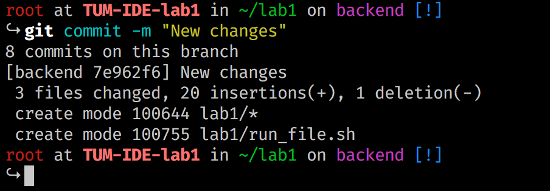

## GIT rebase
git-rebase - Reapply commits on top of another base tip. You can find more about it [here](https://git-scm.com/docs/git-rebase).  

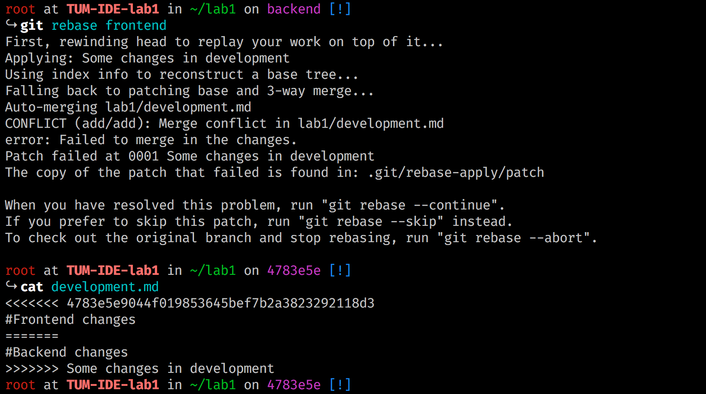

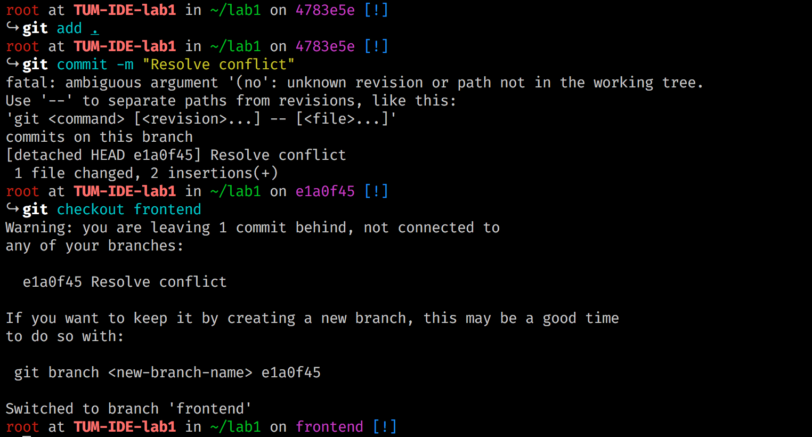

## GIT cherry-pick
git-cherry-pick - Apply the changes introduced by some existing commits. More [here](https://git-scm.com/docs/git-cherry-pick)  

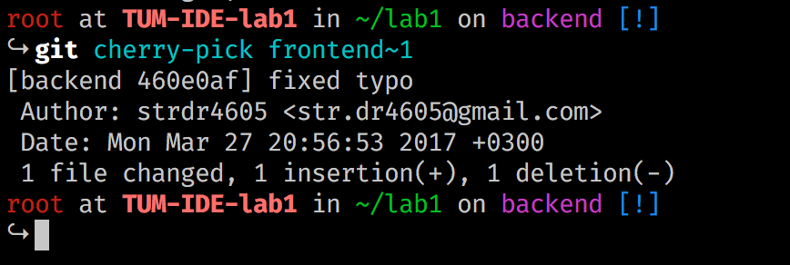

##Conclusion

In any project the most important part is to deliver it to the users. A common approach to this problem is simply set up a remote server and to customize the environment on it to run our project. This is the thing we've done at this laboratory work for some simple programs as "helloworld" are. Imagine if we would have a slightly more difficult project. In this case setting that environment manually as we've done at this laboratory work would take a lot of time. This is the point where such tools as vagrant or docker comes in handy. They allow you to set your environment in more easy way. It could even be as simple as choosing the right box for your project and everything will be set for us.

VCS is a wonderful tool which allow you to control your project, work with a team of developers and to track all the changes which was ever made. We've set a good background on VCS and Git in particular.

There are still a lot of things to discover on this topic. I'll definitely come back to this topic again!
