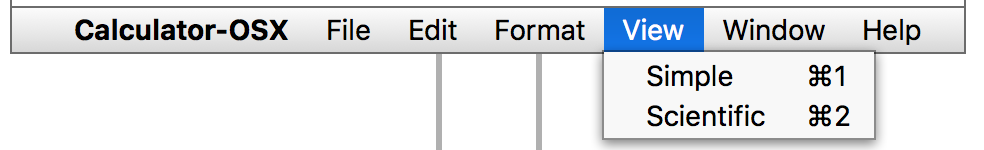
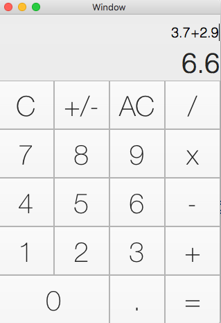
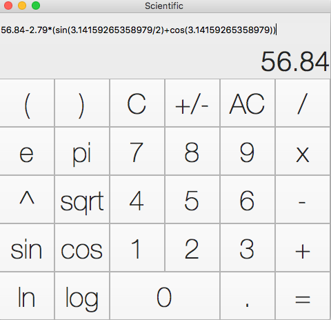

# Integrated Development Environments Laboratory Work #2
## GUI Development

At this laboratory work I have worked with [Alexandru Vdovicenco](https://github.com/ASV44) at [common repo](https://github.com/strdr4605/Calculator-OSX). At this lab. we have developed calculator for Mac OS X, with multiple GUI modules, using Swift language and Xcode IDE.

We divided our work of UI and Business Logic modules in 2 branches `master` and `logic`. My part was UI on `master` branch.

## Work Experience

For UI as an example I used Calculator App from MacOS, but with some changes that I think make experience more intuitively.
I created one view for Simple Calculator, another one for Scientific Calculator and option to switch between them using shortcuts.

  

Also I created 2 Swift classes to communicate with each view.

For arrangement of elements in view I used a feature for Xcode IDE to select, drag and drop elements that I need on me view.

  
  

I added 2 Text Fields, one for last number that you typed and another one for history of current operations.
Also I divided some buttons in groups and created one function for each group:
- **Numbers** a function that add number in *last number field* corresponding to the *tag* of pressed button.
- **Operations** depending on pressed button add selected operation and *last number* typed in *history of current operations* field.
- **AdvancedOperations** handle press on operations like *e*, *pi*, *cos*, *sin* and others.
- Also others functions for *Equal*, *Delete*, *Comma* and *Parenthesis*

User can type operations using also his keyboard (example: for plotting a graph)

You can check my [commits history](https://github.com/strdr4605/Calculator-OSX/commits/master) to understand how I worked on this project.

## Difficulties encountered

- I had to handle some situation when user may input 2 or more operations such as `2*/^5` that is invalid for calculation. For this I used some boolean variables to handle if user pressed an operation button so he cloud not press another one until he had pressed a number button.
- Also I wanted to decorate these views more but Xcode IDE provides more design feature for iOS development and because of few tutorials for MacOS development it was hard find how to design in non programming way.

## Conclusion

Working on this laboratory work, gave me better understanding about development of Desktop app and IDE tools which allow you to optimize your work.Also this was a good experience of working in a team (collaborating and resolving some conflicts). Was a challenge for us to develop an app almost without examples, only with some documentation. I have discovered a lot of new things related to Swift and Mac OS X desktop development.
