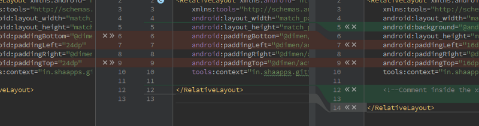

# Integrated Development Environments Laboratory Work #3
## Mobile Applications Development

In this report I will tell you about the Android App that I made together with my colleague [Alexandru Vdovicenco](https://www.facebook.com/sasha.vd.9) at [Cowsay Hack Day](https://github.com/CowsayOrg/cowsay-hackday).  
[ForceThemDoIt](https://github.com/ASV44/ForceThemDoIt) is a fun app which gives you posibility to annoying people by sending sms messages in small interval of time. Recipient of messages has possibility to stop this, only by sending reply message.  

**Be careful because app spends your own sms messages, so if you don't have a lot o them don't abuse this app. You may spend a lot of money.**  

Because we worked on it together we used some features of Android Studio to simplify our work.

## App structure

App is divided in class to simplify work flow.

My task is to build a friendly UI, get data from user and pass to database to store current user's tasks.
SmsSender is a service that run in background and send messages to a list of victims. To simplify user's input data, I created something like ***.csv*** format but with spaces where last item of a row is the number of sender.

## Android Studio features used

- Friendly tools for building UI
- We used `git` as our VCS and Google have implemented VCS in Android Studio, so it was easier for us to commit our changes.
- One of the coolest features in Android Studio and others IDE from [jetbrains](https://www.jetbrains.com/) is conflicts resolving.  

You dont have do delete those lines of conflicts anymore. You just insert parts of code that you need from left or right sides in middle. 
