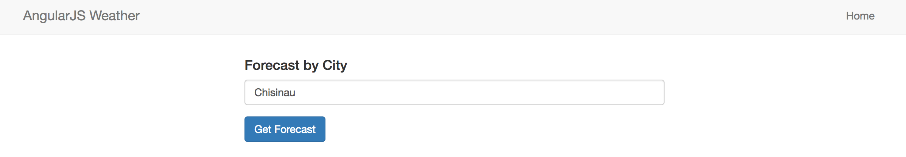
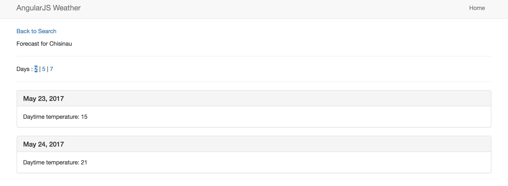

# Integrated Development Environments Laboratory Work #4
## Web development

For this laboratory work I used a web app that I made following an AngularJS course. AngularJS is an open source web application framework. More about it [here](https://angularjs.org/).  
[AngularJS Weather Forecast](http://weather.devasid.com/#/) is a Single Page Application that inform about weather forecast in specified city. You can see the [repository](https://github.com/strdr4605/AngularJS-Weather-Forcast-SPA).  
It is written in AngularJS 1 and I used [Atom](https://atom.io/) as a text editor. **Atom** is a cool, free text editor that I really like.

## AngularJS Weather Forecast

  

  

## AngularJS features that I used

- **Scope** − *These are objects that refer to the model. They act as a glue between controller and view. They contain all data that is displayed on views.*
- **Data-binding** − *It is the automatic synchronization of data between model and view components.*

  `<input type="text" ng-model="city" class="form-control">`

  Then input value will be changing the `$scope.city` variable will also change it's value and vice versa.

- **Controller** − *These are JavaScript functions that are bound to a particular scope.* In this app we have 2 controllers, one for home page and another one for forecast page.
- **Services** − *AngularJS come with several built-in services for example $https: to make a XMLHttpRequests. These are singleton objects which are instantiated only once in app.* This app has one service that gets a request from [openweathermap.org/api](http://openweathermap.org/api).
- **Directives** − *Directives are markers on DOM elements (such as elements, attributes, css, and more). These can be used to create custom HTML tags that serve as new, custom widgets. AngularJS has built-in directives (ngBind, ngModel...).* This app has directive for day forecast.
- **Routing** − *It is concept of switching views.* Using Routing app is switching between home view and forecast view.
- **Model View Whatever** − *MVC is a design pattern for dividing an application into different parts (called Model, View and Controller), each with distinct responsibilities. AngularJS does not implement MVC in the traditional sense, but rather something closer to MVVM (Model-View-ViewModel). The Angular JS team refers it humorously as Model View Whatever.*
- **Dependency Injection** − *AngularJS has a built-in dependency injection subsystem that helps the developer by making the application easier to develop, understand, and test.*

## Advantages of AngularJS
- AngularJS provides capability to create Single Page Application in a very clean and maintainable way.

- AngularJS provides data binding capability to HTML thus giving user a rich and responsive experience

- AngularJS code is unit testable.

- AngularJS uses dependency injection and make use of separation of concerns.

- AngularJS provides reusable components.

- With AngularJS, developer write less code and get more functionality.

- In AngularJS, views are pure html pages, and controllers written in JavaScript do the business processing.

## Disadvantages of AngularJS

  Though AngularJS comes with lots of plus points but same time we should consider the following points:
- **Not Secure** − Being JavaScript only framework, application written in AngularJS are not safe. Server side authentication and authorization is must to keep an application secure.
- **Not degradable** − If your application user disables JavaScript then user will just see the basic page and nothing more.
